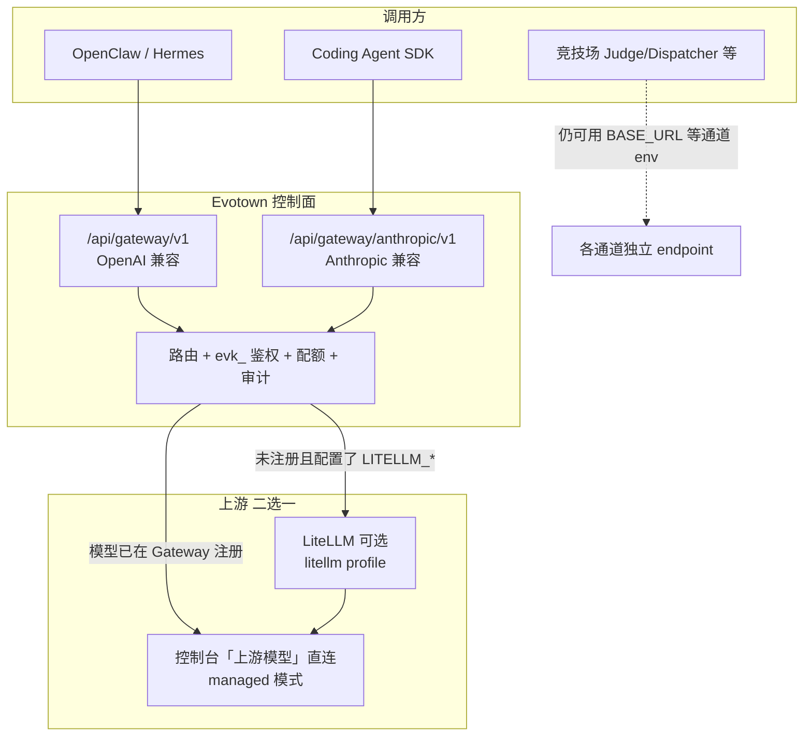

# Coding Agent 与模型网关部署说明

面向在生产环境（HTTPS 域名 + Docker）启用 **Coding Agent 工作台** 的 IT / 平台管理员。

---

## 架构：一条入口，两层上游

Evotown 的推荐模型路径是 **「统一走 Evotown Gateway，上游二选一」**，而不是员工 Agent、Coding Agent、竞技场各配一套 API Key。



### Coding Agent 走哪条路？

| 环节 | 路径 |
|------|------|
| 浏览器 / 控制台 | `https://你的域名/coding-agent/...` |
| 后端执行器 | Claude Agent SDK（默认）或 CLI |
| SDK 的 `ANTHROPIC_BASE_URL` | **`http://backend:8765/api/gateway/anthropic`**（容器内） |
| SDK 的 `ANTHROPIC_API_KEY` | 带 `gateway.chat` + `console.*` 的 **`evk_` Key** |
| Gateway 再转发 | 控制台注册的「上游模型」**或** LiteLLM fallback |

**不是** Coding Agent → LiteLLM 直连；**也不是** Coding Agent → Anthropic 官方直连（除非显式配 `ANTHROPIC_API_KEY` 且不用 Gateway）。

### LiteLLM 和 Gateway 谁更「中心化」？

| 组件 | 角色 | 是否必须 |
|------|------|----------|
| **Evotown Gateway** | 对企业暴露的**唯一业务入口**：鉴权、别名路由、用量、审计 | **推荐必须**（员工 + Coding Agent） |
| **LiteLLM** | Gateway **背后**的可选统一上游；适合模型很多、已有 LiteLLM 运维体系 | 可选 |

**更合理的生产做法：**

1. **对外只暴露 Evotown Gateway**（`…/api/gateway/v1` 与 `…/api/gateway/anthropic`）。
2. 在控制台 **Gateway → 上游模型** 注册 DeepSeek / MiniMax 等（你当前 skilllite.ai 即此模式，**无需 LiteLLM 也能跑通 Coding Agent**）。
3. 若模型种类多、希望与现有 LiteLLM 配置复用，再启用 `docker compose --profile litellm`，并设置 `LITELLM_BASE_URL` / `LITELLM_ANTHROPIC_BASE_URL` 作为 **未注册模型** 的 fallback。

**不推荐**长期维持「Coding Agent 直连 Anthropic + 员工走 Gateway + 竞技场再配一套 BASE_URL」三条互不相干的密钥链——审计与配额会分裂。竞技场通道 env（`JUDGE_*` / `DISPATCHER_*`）可暂时保留，但 Coding Agent 与员工 Agent 应收敛到 Gateway。

---

## 生产 `.env` 最小配置（服务器上，勿提交 Git）

在 `docker-compose.yml` 同级 `.env` 增加（密钥换成你的值）：

```bash
# 对外 URL（SSO、OpenClaw manifest、CORS）
EVOTOWN_PUBLIC_URL=https://www.skilllite.ai
CORS_ORIGINS=https://www.skilllite.ai

# Coding Agent → Evotown Gateway（Anthropic 兼容）
EVOTOWN_CLAUDE_USE_GATEWAY=1
EVOTOWN_CLAUDE_GATEWAY_BASE_URL=http://backend:8765/api/gateway/anthropic
EVOTOWN_CLAUDE_GATEWAY_API_KEY=evk_xxxxxxxx
EVOTOWN_CLAUDE_EXECUTION_MODE=sdk
```

### 图片识图（Vision）

上传的图片附件**不会**自动被 `deepseek-v4-flash` 等纯文本模型「看见」。需在 Gateway 注册 **支持 OpenAI 多模态** 的上游模型，并配置：

```bash
# 与 deepseek-v4-flash 分开；示例为通义千问 VL（需在控制台注册 api_base / api_key）
EVOTOWN_CLAUDE_VISION_MODEL=qwen-vl-plus
EVOTOWN_CLAUDE_VISION_MAX_TOKENS=2048
```

流程：Run 启动前 Evotown 调用视觉模型做 **vision preflight**，将识图结果注入 Agent prompt；对话 UI 会显示「图片视觉分析完成」事件。

| 模型 | 是否可用于 EVOTOWN_CLAUDE_VISION_MODEL |
|------|--------------------------------------|
| `deepseek-v4-flash` | ❌ 纯文本，不支持 image_url |
| 通义 `qwen-vl-plus` / `qwen-vl-max` | ✅ OpenAI 兼容多模态 |
| OpenAI `gpt-4o` 等 | ✅ |

### 常见错误

| 错误配置 | 现象 |
|----------|------|
| `…/api/gateway/v1` 作为 Claude `BASE_URL` | SDK 请求 `/v1/v1/messages` → **404** |
| 未设 `EVOTOWN_CLAUDE_USE_GATEWAY` | 直连 Anthropic，控制台选的 DeepSeek 路由**不生效** |
| `ANTHROPIC_API_KEY` 为空且未走 Gateway | `ConnectionRefused` 或 dry-run |
| 上游模型未配 `anthropic_api_base` | Anthropic 协议转发失败（OpenAI-only 的 api_base 不够） |
| Run 超过 `EVOTOWN_CLAUDE_RUN_TIMEOUT_SEC` | 自动 failed；UI「取消运行」→ `POST .../cancel` |

DeepSeek 等在控制台注册上游模型时，需填写 **Anthropic 兼容** 的 `anthropic_api_base`（若供应商提供），或改用 LiteLLM 的 Anthropic 代理。

---

## Gateway 上游模型 vs LiteLLM（代码行为）

实现见 `backend/infra/gateway_upstream.py`：

1. 请求模型 alias（如 `deepseek-v4-flash`）在 **Gateway → 上游模型** 已注册  
   → **直连** 该行的 `api_base` / `anthropic_api_base`（**managed**，不经过 LiteLLM）。
2. 未注册且配置了 `LITELLM_BASE_URL` / `LITELLM_ANTHROPIC_BASE_URL`  
   → 转发到 LiteLLM（**litellm** 模式）。
3. 两者皆无  
   → 503，提示在控制台添加模型或配置 LiteLLM。

Coding Agent 的 Anthropic 请求走第 1 或第 2 条，**始终先经过 Evotown Gateway**。

---

## 部署清单

### 1. Git 更新（代码与模板）

```bash
cd /path/to/evotown
git pull origin main
docker compose up -d --build
```

### 2. 服务器 `.env`（私有）

按上文填写 `EVOTOWN_PUBLIC_URL`、`EVOTOWN_CLAUDE_*`、`CORS_ORIGINS`。

### 3. 控制台

1. `/login` 使用 `evk_` Key 登录  
2. **Gateway → 上游模型**：注册模型 + Anthropic/OpenAI 端点  
3. **Gateway → 路由**：alias 与模型名一致（如 `deepseek-v4-flash`）  
4. **Accounts**：签发带 `gateway.chat`、`console.read`、`console.write` 的 Key  

### 4. HTTPS 反代（Caddy / Nginx）

仓库根目录 `Caddyfile` 为示例；生产多站点时只改 **skilllite / evotown** 段，勿覆盖整份 `/etc/caddy/Caddyfile`：

```caddy
www.example.com {
    reverse_proxy localhost:8080 {
        header_up X-Forwarded-Proto {scheme}
        header_up X-Forwarded-For {remote_host}
    }
}
```

### 5. 验收

```bash
# 健康
curl -fsS https://www.example.com/health

# 登录 Key 创建 Coding run（应数十秒内 succeeded）
curl -fsS -X POST "https://www.example.com/api/v1/workspaces/<ws_id>/runs" \
  -H "Authorization: Bearer evk_xxx" \
  -H "Content-Type: application/json" \
  -d '{"prompt":"你好","model":"deepseek-v4-flash"}'
```

---

## 相关文档

- [ENTERPRISE_QUICKSTART.md](./ENTERPRISE_QUICKSTART.md) — 企业一键部署  
- [ENTERPRISE_KEY_LIFECYCLE.md](./ENTERPRISE_KEY_LIFECYCLE.md) — `evk_` 生命周期  
- [PRIVATE_SKILLS_MARKET_DEPLOYMENT.md](./PRIVATE_SKILLS_MARKET_DEPLOYMENT.md) — Skills 市场  
- 模板：`docs/templates/env.enterprise.example`、`.env.example`
