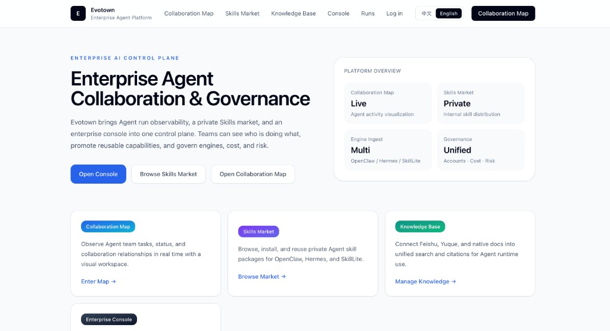

# Evotown — 企业 Agent 运行治理与能力资产中台

> **一句话：** Evotown 是企业 Agent 的**私有化控制面** —— 员工继续在本机跑 OpenClaw、Hermes 或 SkillLite；IT 用 Evotown 统一管**模型、Skill、知识**与**合规**。

**Evotown 是企业 Agent 的运行治理与能力资产中台** —— 统一接入多种 Agent runtime，沉淀 Skills 与企业知识，提供观测、审核与私有分发。

执行端仍留在原处（员工笔记本、CI、服务器、容器）；Evotown 是其上层的 **控制面**。**不是** IM 套件，**不是**面向全员的 ChatGPT，**也不是**替代 OpenClaw/Hermes 的运行时。项目同时包含 **进化竞技场（Arena）**，用于 benchmark 与可复现实验。

[English](../en/README.md)

## 产品预览

<p align="center">
  
</p>

*企业 Agent 协作与治理平台首页。*

---

## 电梯演讲（30 秒）

公司已经在员工电脑上跑 Agent（OpenClaw、Hermes…）。Evotown 给 IT 一层**可私有化部署**的能力：

1. **统一模型入口** — 网关 + 身份 + 配额 + 审计 + 成本归属  
2. **私有 SkillHub** — 上传、审核、按团队下发、包签名校验  
3. **企业知识** — 飞书/语雀 Connector + Native KB，不绑单一厂商  
4. **运行观测** — 引擎、会话、Runs、风控，**不把执行搬进云端**

**IT 一键部署，员工两行配置。** 钉钉/飞书 Bot、内部 Copilot 走同一套 API。

→ **推荐路径：** [企业快速接入（IT 一键 + 员工两行）](../docs/zh-CN/ENTERPRISE_QUICKSTART.md)

---

## Evotown 是什么 —— 不是什么

| **是** | **不是** |
|--------|----------|
| Agent **运行治理与能力资产中台** | 给全员用的「企业版 ChatGPT」 |
| **Runtime 中立**（OpenClaw / Hermes / SkillLite / 自研） | 托管 Agent、替代本机 runtime |
| 私有化 **模型网关** + **SkillHub** + 知识连接器 | 与云厂商大模型 API 正面竞争 |
| 开源、可私有化、证据驱动资产晋升 | 通用低代码 / iPaaS 集成平台 |
| 可选 **进化竞技场** 做 R&D | 生产落地必须依赖 Arena |

**原则：** runtime 中立 · 证据驱动资产晋升 · 可私有化部署 · 控制而不锁定

---

## 架构

```text
  员工本机 / CI / 服务器                 内网（Docker / K8s）
  OpenClaw · Hermes · SkillLite            ┌─────────────────────────────┐
       │  两行 env 配置                     │  Evotown 控制面              │
       │  OPENAI_BASE_URL → 网关            │  · Gateway（→ LiteLLM）      │
       │  manifest → SkillHub              │  · 私有 Skills 市场          │
       └──────────────────────────────────►│  · 知识库 + 控制台           │
                                            │  · Runs / 成本 / 风控        │
                                            └──────────────┬──────────────┘
                                                           │
                                            业务应用（Bot、Copilot、CRM）
```

| 层级 | 职责 |
|------|------|
| **Runtime** | OpenClaw / Hermes / SkillLite / 自研 Agent **本地执行** |
| **Evotown** | 网关、账号、SSO；私有 Skills 市场；知识库；引擎注册；Runs、成本、风控 |
| **业务应用** | 钉钉/飞书 Bot、内部 Copilot —— 通过 API 消费 skill 与知识 |

---

## 核心能力（企业 MVP）

| 维度 | 内容 |
|------|------|
| **治理** | 控制台账号（`evk_`）、OIDC SSO、团队隔离、Skill 审核/下线、密钥生命周期 |
| **路由** | OpenAI 兼容网关（前置 LiteLLM）；按 alias 模型路由；流式；配额与 burst |
| **分发** | 私有 SkillHub；manifest 下发；包签名；OpenClaw 官方格式 plugin |
| **沉淀** | 飞书/语雀 Connector + Native KB、分块引用检索 |
| **观测** | 引擎注册、Runs、网关用量、会话、成本与风控事件 |
| **落地** | `enterprise-deploy.sh`、`evotown-agent-setup.py`、MDM 脚本 |

**Arena** 面向进化实验与演示，生产 Agent  rollout **不依赖** Arena。

---

## 与开源生态的对比

很多项目只覆盖**其中一层**；同时具备 **本机 runtime 中立 + 私有 SkillHub + 网关治理** 的开源控制面较少。

| 类型 | 代表 | 与 Evotown 关系 |
|------|------|-----------------|
| 纯 LLM 网关 | LiteLLM | Evotown **组合** LiteLLM，叠加企业身份、审计、SkillHub |
| 全员 Chat / RAG | Onyx、Dify | 面向终端聊天；Evotown 做 **Agent 治理**，不做 ChatGPT 替代品 |
| 全栈 Agent 平台 | Synkora 等 | 常托管 Agent；Evotown **不托管** runtime |
| Agent 控制面 | Keviq、Kagenti | 治理/编排更接近；Evotown 更轻，面向 **OpenClaw/Hermes 企业落地** |

**差异化：** 与现有 runtime 组合 · SkillHub 是一等公民 · IT 一键 + 员工两行 · 可选 Arena 做 R&D

---

## 平台入口（MVP）

| 路由 | 说明 |
|------|------|
| `/` | 企业风落地页 |
| `/login` | 控制台登录（`evk_` / OIDC SSO） |
| `/dashboard` … `/risk` | 企业管理后台 |
| `/gateway` | 网关用量 + 模型路由 |
| `/accounts` | 账号与 API Key |
| `/market` | Skills 市场（员工安装指引） |
| `/skills` | 管理端：上传、审核、下线 |
| `/knowledge` | 知识库 |
| `/arena` | 进化竞技场 |

规格：[spec/README.md](../spec/README.md) · [企业控制面](../spec/enterprise-control-plane.md)

---

## 企业落地（推荐）

```bash
# IT
./scripts/enterprise-deploy.sh
```

员工本机（来自 `deploy-output/evotown.agent.env`）：

```bash
OPENAI_BASE_URL=https://evotown.company.internal/api/gateway/v1
OPENAI_API_KEY=evk_xxxxxxxx
```

| 文档 | 链接 |
|------|------|
| 企业快速接入 | [ENTERPRISE_QUICKSTART.md](../docs/zh-CN/ENTERPRISE_QUICKSTART.md) |
| MDM 批量下发 | [MDM_AGENT_ROLLOUT.md](../docs/zh-CN/MDM_AGENT_ROLLOUT.md) |
| 密钥生命周期 | [ENTERPRISE_KEY_LIFECYCLE.md](../docs/zh-CN/ENTERPRISE_KEY_LIFECYCLE.md) |
| OpenClaw 插件 | [integrations/openclaw/evotown/](../integrations/openclaw/evotown/) |

---

## 进化测试（原有能力）

将 **进化引擎** 置于可控环境中做**进化效果验证** —— OpenClaw 系、Hermes、自研 harness，或 **可选地** [SkillLite](https://github.com/EXboys/skilllite)。通过 [ingest API](../docs/zh-CN/EVOTOWN-ENGINE-INGEST-V0.1.md) 接入执行端即可。

## 快速开始

### Docker（推荐）

```bash
cd evotown
cp .env.example .env
docker compose up -d --build
```

访问 http://localhost

### 本地开发

```bash
cd evotown/backend && pip install -r requirements.txt && uvicorn main:app --host 0.0.0.0 --port 8765
cd evotown/frontend && npm install && npm run dev
```

访问 http://localhost:5174

> 数据目录：`evotown/data/`（可用 `EVOTOWN_DATA_DIR` 覆盖）

## 配置要点

- **引擎 ingest：** `EVOTOWN_ENGINE_INGEST_TOKEN`
- **控制台：** `/login` 或 `ADMIN_TOKEN`；可选 `EVOTOWN_OIDC_*` SSO
- **Skill 签名：** `EVOTOWN_SKILL_SIGNING_SECRET`
- **模型网关：** `LITELLM_BASE_URL` + `OPENAI_BASE_URL=…/api/gateway/v1`

## 关联文档

- [Evotown spec index](../spec/README.md)
- [企业控制面产品规格](../docs/zh-CN/ENTERPRISE_CONTROL_PLANE_PRODUCT_SPEC.md)
- [私有 Skills 市场部署](../docs/zh-CN/PRIVATE_SKILLS_MARKET_DEPLOYMENT.md)
- [引擎接入 API](../docs/zh-CN/EVOTOWN-ENGINE-INGEST-V0.1.md)
- [奖励机制](../docs/zh-CN/REWARD_MECHANISM.md) · [进化机制](../docs/zh-CN/EVOLUTION_MECHANISM_ANALYSIS.md)
